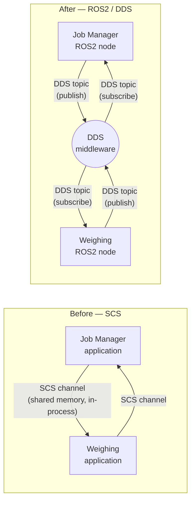
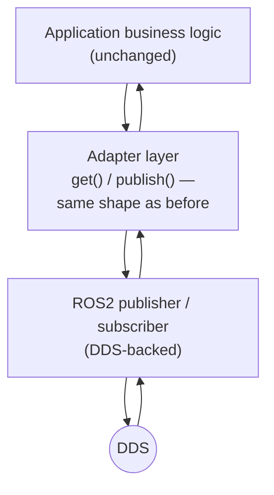
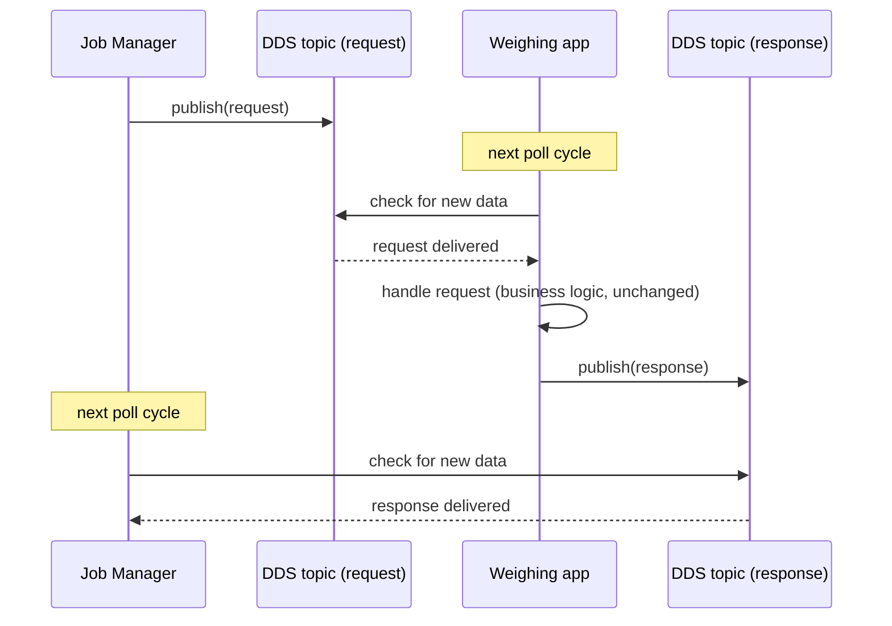

# Technical Overview — ROS2/DDS Communication Migration

This document describes the actual mechanisms used to move
inter-application communication from the platform's internal
communication service (SCS) onto ROS2/DDS — the message model, the
adapter layer, and the reasoning behind each choice.

## 1. Architecture, before and after

Each application previously exchanged data through SCS channels: an
in-process construct that let two co-located processes on the same
platform pass structured data back and forth. That's replaced with ROS2
nodes publishing and subscribing to DDS topics — a real pub/sub messaging
layer with its own discovery, serialization, and transport underneath.

The key architectural shift is that the two applications no longer need to
be co-located in the same runtime to talk to each other — DDS discovery
and transport handle that. For now, both still run as before; only the
transport underneath changed.

## 2. Message layer: from structs to a typed IDL

SCS channels carried hand-written C++ structs. DDS requires messages
described in an interface definition format (ROS2 `.msg` files), which get
compiled into strongly-typed C++ classes with generated (de)serialization
code. Each SCS struct in scope was mirrored 1:1 as a
`.msg` definition — same fields, same meaning, just declared in a form the
DDS toolchain can generate code from and send over the wire.

This is a mechanical, field-preserving translation. No fields were added,
removed, or reinterpreted; the goal was that anything reading the new
message type sees the same information as it would have read from the old
struct.

## 3. The adapter layer

Every change here was made with one guiding principle: keep code changes
to a minimum and leave the existing logic completely intact.

Both applications already interacted with their communication channels
through a small, consistent set of operations — something like "check
whether a new request arrived," "send a response," "publish the latest
status." Rather than rewriting every call site to talk to ROS2 publishers
and subscribers directly, a thin adapter layer was introduced that exposes
those exact same operations, backed internally by real ROS2 publishers and
subscribers.

From the business logic's point of view, nothing changed shape — it still
asks "is there a new request?" and gets one back if so. What changed is
purely what happens underneath that call.

## 4. Node and executor model

Each application owns a single ROS2 node, shared by all of its adapter
instances. ROS2 requires an *executor* to actually pump incoming messages
into a node's subscriptions — without it, published data would sit
undelivered. Rather than running the executor on its own background
thread, it's driven manually, once per application work cycle, from the
same thread the rest of the application already runs on. That keeps the
existing single-threaded, sequential design intact — no callback ever
fires on a separate thread, so no new locking is needed anywhere.

## 5. Communication patterns

Two distinct patterns carry over from the original design, now expressed
as DDS topics instead of SCS channels:

**Request / response.** One side publishes a request; the other, while
polling for incoming data, sees it, acts on it, and publishes a response
back. This is a two-topic pattern — one for requests, one for responses.

**Periodic broadcast.** The Weighing application continuously publishes
its current status and payload data on its own cycle, independent of any
request — any other node subscribed to that topic simply receives the
latest value each time it's published. This maps directly onto DDS's
native publish/subscribe model.

## 6. What this covers

This work validates the approach end-to-end on one well-defined slice of
the two applications' communication — enough to prove the message model
and the adapter pattern hold up together. The remaining communication
paths are expected to follow the same pattern going forward.

## 7. Open items going into real integration

- Wiring the real build system to link against the ROS2/DDS libraries
  this now depends on.
- Running both applications together on real hardware to confirm timing
  and DDS discovery behave as expected outside a development environment.
- Deciding, app by app, whether the remaining unconverted communication
  paths get migrated the same way or reconsidered as part of a larger
  redesign.
