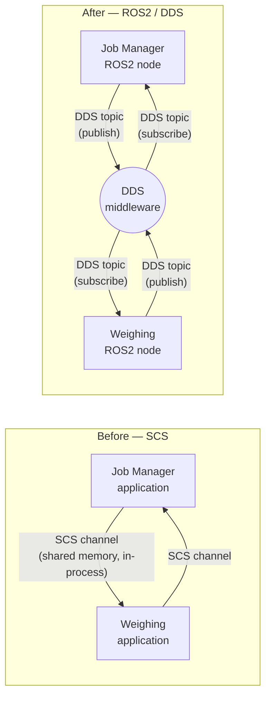
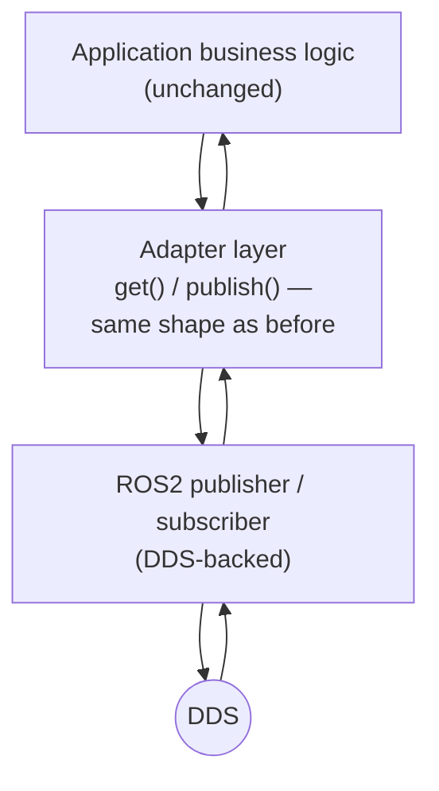
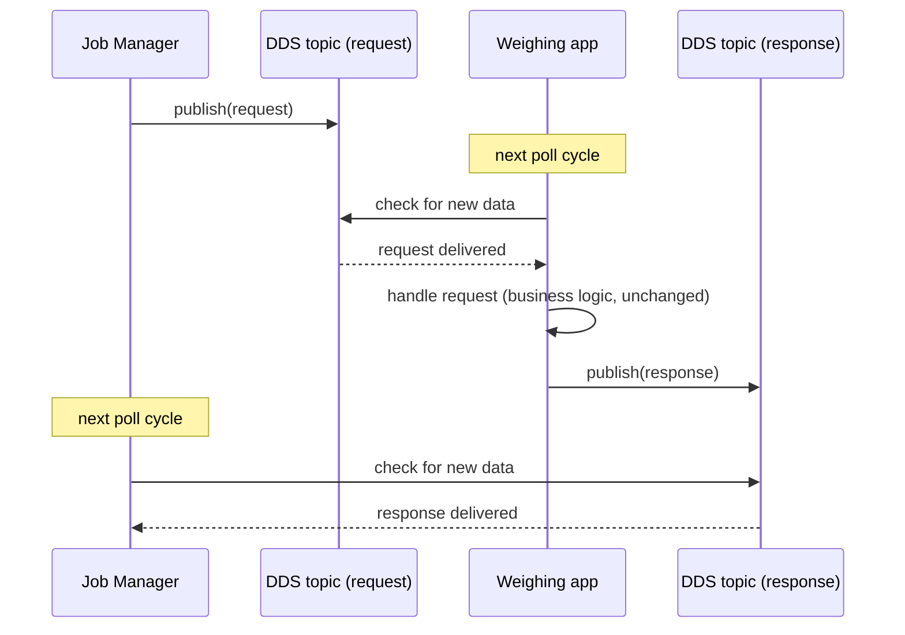
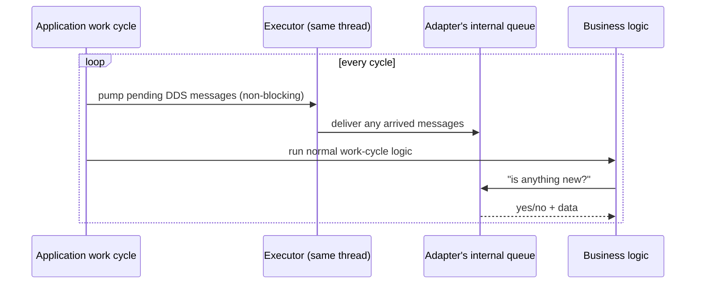

# Stage 1 Technical Overview — ROS2/DDS Communication Migration

This document goes one level deeper than the project README: it describes
the actual mechanisms used to move inter-application communication from the
platform's internal communication service (SCS) onto ROS2/DDS — the message
model, the adapter layer, the threading model, and the reasoning behind
each choice.

## 1. Architecture, before and after

Each application previously exchanged data through SCS channels: an
in-process construct that let two co-located processes on the same
platform pass structured data back and forth. That's replaced with ROS2
nodes publishing and subscribing to DDS topics — a real pub/sub messaging
layer with its own discovery, serialization, and transport underneath.

The key architectural shift is that the two applications no longer need to
be co-located in the same runtime to talk to each other — DDS discovery
and transport handle that — but for this stage, both still run as before;
only the transport underneath changed.

## 2. Message layer: from structs to a typed IDL

SCS channels carried hand-written C++ structs. DDS requires messages
described in an interface definition format (ROS2 `.msg` files), which get
compiled into strongly-typed C++ classes with generated (de)serialization
code. Each SCS struct used in this stage's scope was mirrored 1:1 as a
`.msg` definition — same fields, same meaning, just declared in a form the
DDS toolchain can generate code from and send over the wire.

This is a mechanical, field-preserving translation. No fields were added,
removed, or reinterpreted; the goal was that anything reading the new
message type sees the same information as it would have read from the old
struct.

## 3. The adapter layer

The biggest design decision was *how much of the surrounding application
code should have to change*. The answer: as little as possible.

Both applications already interacted with their communication channels
through a small, consistent set of operations — something like "check
whether a new request arrived," "send a response," "publish the latest
status." Rather than rewriting every call site to talk to ROS2 publishers
and subscribers directly, a thin adapter layer was introduced that exposes
those exact same operations, backed internally by real ROS2 publishers and
subscribers.

From the business logic's point of view, nothing changed shape — it still
asks "is there a new request?" and gets one back if so. What changed is
purely what happens underneath that call.

## 4. Node and executor model

Each application owns a single ROS2 node, shared by all of its adapter
instances. ROS2 requires an *executor* to actually pump incoming messages
into a node's subscriptions — without it, published data would sit
undelivered. Rather than running the executor on its own background
thread (the more typical ROS2 pattern), it's driven manually, once per
application work cycle, from the same thread the rest of the application
already runs on.

## 5. Communication patterns

Two distinct patterns carry over from the original design, now expressed
as DDS topics instead of SCS channels:

**Request / response.** One side publishes a request; the other, while
polling for incoming data, sees it, acts on it, and publishes a response
back. This is a two-topic pattern (one for requests, one for responses)
rather than a single blocking call — DDS is inherently asynchronous
pub/sub, not RPC, so the request/response *pairing* is something the
application logic already handled the same way before (matching a
response to the request that caused it), and that pairing logic didn't
need to change.

**Periodic broadcast.** The Weighing application continuously publishes
its current status and payload data on its own cycle, independent of any
request — any other node subscribed to that topic simply receives the
latest value each time it's published. This maps directly onto DDS's
native publish/subscribe model, arguably more naturally than the original
channel-based approach did.

## 6. Threading and concurrency model

This is the design decision most worth calling out explicitly, because
it's the one place a naive ROS2 integration would have looked very
different.

ROS2 applications commonly spin an executor continuously on a background
thread, with callbacks firing asynchronously whenever a message arrives.
That model is powerful, but it also introduces real concurrency
concerns — shared state now needs locking, and code that was written
assuming single-threaded, sequential execution can break in subtle ways.

Both applications here were already built around a simple, synchronous
work-cycle loop: do some work, check for new inputs, respond, repeat —
all on one thread, no locks anywhere. To preserve that guarantee, the
executor is stepped once per cycle (a single non-blocking pass that
delivers whatever has arrived since the last cycle), and the adapter's
"check for new data" call simply reads whatever that pass already
delivered. No callback ever fires on a separate thread; nothing here is
asynchronous relative to the rest of the application.

The trade-off is latency: a message that arrives is only picked up on the
*next* cycle, not the instant it lands. For applications already built
around a fixed-rate work cycle, that's not a meaningful difference from
how the original channel-based communication behaved — it was never
truly instantaneous either.

## 7. What this stage covers

This first stage validates the approach end-to-end on one well-defined
slice of the two applications' communication — enough to prove the
message model, the adapter pattern, and the polling/threading model all
hold up together. The remaining communication paths are expected to
follow the same pattern in later stages.

## 8. Open items going into real integration

- Wiring the real build system to link against the ROS2/DDS libraries
  this now depends on.
- Running both applications together on real hardware to confirm timing
  and DDS discovery behave as expected outside a development environment.
- Deciding, app by app, whether the remaining unconverted communication
  paths get migrated the same way or reconsidered as part of a larger
  redesign.
