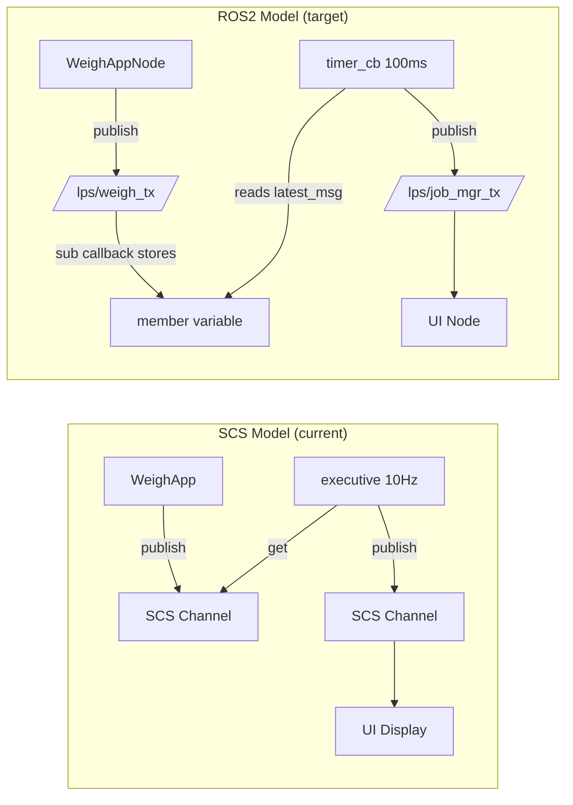

# SCS → ROS2 Migration Guide
### CPM-Loader-ais: LpsSaJobMgrApp + LpsSaWeighApp

---

## Table of Contents

1. [Short Answer](#1-short-answer)
2. [Core Concept Mapping](#2-core-concept-mapping)
3. [Architecture Comparison](#3-architecture-comparison)
4. [The Critical Paradigm Shift: Pull vs Push](#4-the-critical-paradigm-shift-pull-vs-push)
5. [Phase 1 — Channel Inventory](#phase-1--channel-inventory)
6. [Phase 2 — ROS2 Message Definitions](#phase-2--ros2-message-definitions)
7. [Phase 3 — ROS2 Package and Workspace Structure](#phase-3--ros2-package-and-workspace-structure)
8. [Phase 4 — Node Skeleton with Lifecycle](#phase-4--node-skeleton-with-lifecycle)
9. [Phase 5 — Port the Communication Layer](#phase-5--port-the-communication-layer)
10. [Phase 6 — Business Logic Integration](#phase-6--business-logic-integration)
11. [Phase 7 — NVM Thread](#phase-7--nvm-thread)
12. [Phase 8 — Hardware I/O (HAL Nodes)](#phase-8--hardware-io-hal-nodes)
13. [Phase 9 — Configuration Migration (.rb → YAML)](#phase-9--configuration-migration-rb--yaml)
14. [Phase 10 — QoS Configuration](#phase-10--qos-configuration)
15. [Issues and Risks — Deep Dive](#15-issues-and-risks--deep-dive)
16. [Testing Strategy](#16-testing-strategy)
17. [Communication Assessment Summary](#17-communication-assessment-summary)
18. [Full Migration Checklist](#18-full-migration-checklist)

---

## 1. Short Answer

**Will it just work?** No — but it is very doable.

The **business logic stays completely untouched**. `lps_pass_tracker`, `lps_weighing`, and `lps_cal` are pure C/C++ algorithmic libraries. They take input structs, return output structs. They have zero SCS/AIS dependencies. You link them directly into your ROS2 nodes and call the exact same APIs.

What changes is the **communication layer** — the shell around the business logic. Every `InputInterface<T>::get()` becomes a stored latest-message from a ROS2 subscription. Every `OutputInterface<T>::publish()` becomes a ROS2 publisher call. The cyclic `executive()` becomes a ROS2 timer callback.

The hard parts are:
- Timing determinism (RTOS → Linux soft real-time)
- The pull vs push paradigm difference (biggest trap for silent bugs)
- Hardware I/O channels (STG4 button, horn relay, PWM sensors)
- Startup sequencing (NvmInitialize blocking)

---

## 2. Core Concept Mapping

| AIS / SCS Concept | ROS2 Equivalent | Notes |
|-------------------|----------------|-------|
| `OutputInterface<T>::publish(data)` | `publisher->publish(msg)` | Near-direct. Struct fields copy to message fields. |
| `InputInterface<T>::get(data)` | Latest-sample pattern: subscription callback stores msg, timer reads it | **Biggest paradigm difference — see Section 4** |
| `InterfaceDb::fetch("channelName")` | `create_publisher()` / `create_subscription()` in constructor | No blocking fetch; pub/sub created at node startup |
| `task::Task` subclass | `rclcpp::LifecycleNode` subclass | Lifecycle node preserves the init/run/shutdown model |
| `initialize()` | `on_configure()` lifecycle callback | Can block here safely; NVM reads go here |
| `executive()` at 10 Hz | `create_wall_timer(100ms, &callback)` | Timer IS the executive |
| `cleanup()` | `on_shutdown()` or node destructor | MSN check + NVM flush |
| SCS channel (typed C struct) | ROS2 `.msg` file | Each channel → one `.msg`. Fields map 1:1. |
| SCS channel FIFO queue (depth N) | QoS `KEEP_LAST, depth=N` | Direct mapping, taken from `.rb` config |
| `.rb` config params | `declare_parameter()` + YAML param file | `cycleRate_hz`, defaults, topic names |
| `task_1x()` RTOS thread | `std::thread` + `std::atomic<bool>` write flags | Same logic, POSIX thread instead of RTOS task |
| Same-ECU shared memory | FastDDS SHM transport or Cyclone SHM | Must configure explicitly — not default |
| `InterfaceDb::fetch()` blocking | No equivalent needed | ROS2 pub/sub handles discovery automatically |

---

## 3. Architecture Comparison

### SCS Architecture (current)

```
┌──────────────────────────────────────────────────────────────────────────┐
│  RTOS (POSIX real-time OS)                                               │
│                                                                          │
│  ┌─────────────────────┐        SCS Channel         ┌────────────────┐  │
│  │  LpsSaJobMgrApp     │◄──── (shared memory) ────►│ LpsSaWeighApp  │  │
│  │                     │                            │                │  │
│  │  executive() 10Hz   │      C-struct FIFO         │ executive() 10Hz│ │
│  │  (RTOS task)        │      depth N              │  (RTOS task)   │  │
│  └──────────┬──────────┘                            └───────┬────────┘  │
│             │  LpsPtInputs_t                                │           │
│             ▼                                               │           │
│  ┌────────────────────┐                        ┌──────────────────────┐ │
│  │  lps_pass_tracker  │                        │  lps_weighing        │ │
│  │  (external lib)    │                        │  lps_cal             │ │
│  └────────────────────┘                        │  (external libs)     │ │
│                                                └──────────────────────┘ │
│  ┌────────────────────┐                                                  │
│  │  task_1x()         │  ← NVM thread (separate RTOS task)              │
│  └────────────────────┘                                                  │
└──────────────────────────────────────────────────────────────────────────┘
        │                              │
    UI Display                    Hardware sensors
    (SCS channel)                 (BSP / PWM / GPIO)
```

### ROS2 Architecture (target)

```
┌──────────────────────────────────────────────────────────────────────────┐
│  Linux (PREEMPT_RT kernel recommended)                                   │
│                                                                          │
│  ┌─────────────────────┐     ROS2 Topic (DDS)    ┌────────────────────┐ │
│  │  JobMgrNode         │◄─── FastDDS SHM ───────►│  WeighAppNode      │ │
│  │  (LifecycleNode)    │                          │  (LifecycleNode)   │ │
│  │                     │    /lps/weigh_tx         │                    │ │
│  │  timer_cb() 100ms   │    /lps/weigh_reqst      │  timer_cb() 100ms  │ │
│  └──────────┬──────────┘                          └──────────┬─────────┘ │
│             │  LpsPtInputs_t (unchanged)                     │           │
│             ▼                                                │           │
│  ┌────────────────────┐                        ┌──────────────────────┐  │
│  │  lps_pass_tracker  │                        │  lps_weighing        │  │
│  │  (unchanged — same │                        │  lps_cal             │  │
│  │   library binary)  │                        │  (unchanged)         │  │
│  └────────────────────┘                        └──────────────────────┘  │
│                                                                           │
│  ┌────────────────────┐   ┌──────────────────┐   ┌──────────────────┐   │
│  │  std::thread NVM   │   │  HalNode         │   │  MockNode        │   │
│  │  (atomic flags)    │   │  (GPIO, PWM)     │   │  (for testing)   │   │
│  └────────────────────┘   └──────────────────┘   └──────────────────┘   │
└──────────────────────────────────────────────────────────────────────────┘
        │                              │
    /lps/job_mgr_tx               /lps/switch_input
    (ROS2 topic)                  /lps/output_channel
    → UI Display node             (HalNode topics)
```

### Data Flow Comparison



---

## 4. The Critical Paradigm Shift: Pull vs Push

This is the most important concept to understand. Get it wrong and you will have silent, hard-to-debug issues.

### SCS — Pull Model (current)

```
RTOS timer fires → executive() runs → explicitly PULL data:

executive() {
    input->get(data);   // pulls latest sample from channel queue
    process(data);      // use the data right now
    output->publish(result);
}
```

`get()` always returns something — either fresh data or the last received value if no new data arrived. The executive is the master clock. Data is consumed synchronously, in order, every cycle.

### ROS2 naive — Push Model (wrong approach for AIS migration)

```cpp
// WRONG for AIS migration — don't do this
void weigh_tx_callback(const WeighTx::SharedPtr msg) {
    // This fires whenever WeighApp publishes — not at your cycle rate
    // You lose the cyclic determinism entirely
    process(msg);   // ← processing happens at publish rate, not your rate
}
```

### ROS2 correct — Latest-Sample Pattern (what you want)

```cpp
class JobMgrNode : public rclcpp::LifecycleNode {
private:
    // ── Member variables hold "latest received" from each subscription ──
    lps_msgs::msg::LpsSaWeighTx  latest_weigh_tx_{};    // zero-initialized (safe default)
    lps_msgs::msg::LpsSaJobMgrReqst latest_reqst_{};
    lps_msgs::msg::SwitchInput   latest_switch_{};

    // ── Subscriptions store into member vars — no processing here ──
    void on_weigh_tx(const lps_msgs::msg::LpsSaWeighTx::SharedPtr msg) {
        latest_weigh_tx_ = *msg;   // just store — executive reads it on next tick
    }

    // ── Timer fires at 10 Hz — this IS the executive ──
    void executive() {
        scs_rx();          // phase 1: populate inputs FROM latest_* variables
        pt_update();       // phase 2: call weigh_mode() — unchanged
        send_cmd();        // phase 3: command WeighApp
        handle_horn();     // phase 4
        process_store();   // phase 5
        scs_tx();          // phase 6: publish all outputs
    }
};
```

**Why this matters:**
- `latest_weigh_tx_` is zero-initialized before any data arrives → safe default (same as SCS channel with no publisher yet)
- The timer is the master clock, not the subscription callback
- If WeighApp misses a cycle, you use the previous value — exactly what SCS does
- If WeighApp publishes twice before your timer fires, you use the most recent — exactly what `get()` does (reads latest)

---

## Phase 1 — Channel Inventory

Before writing any code, extract every channel from every `.rb` config file for both apps. You need this list to create message definitions, topic names, and QoS settings.

### What to look for in `.rb` files

Open `config/LpsSaJobMgrApp.rb` and `config/LpsSaWeighApp.rb`. For each channel entry, record:

| Field to record | Where it appears in .rb | Maps to |
|----------------|------------------------|---------|
| Channel base name | `"LpsSaWeighTxChannel"` | ROS2 topic name (snake_case it) |
| Direction (`input`/`output`) | Channel type declaration | `create_subscription` or `create_publisher` |
| C struct type | `LpsSaWeighTxChannel_t` | `.msg` file to create |
| Queue depth | `queue_size: 10` | QoS `KEEP_LAST depth` |
| Cycle rate | `cycleRate_hz: 10.0` | Timer period = `1000 / hz` ms |

### Complete Channel List (both apps)

```
Channel Name                          App(s)          Direction        Struct Type
──────────────────────────────────────────────────────────────────────────────────
LpsSaJobMgrReqstChannel               JobMgr          IN               LpsSaJobMgrReqstChannel_t
LpsSaJobMgrTxChannel                  JobMgr          OUT              LpsSaJobMgrTxChannel_t
LpsSaJobMgrRespChannel                JobMgr          OUT              LpsSaJobMgrRespChannel_t
LpsSaJobMgrDebugChannel               JobMgr          OUT              LpsSaJobMgrDebugChannel_t
LpsSaWeighReqstChannel                JobMgr          OUT / WeighApp IN LpsSaWeighReqstChannel_t
LpsSaWeighTxChannel                   WeighApp        OUT / JobMgr IN  LpsSaWeighTxChannel_t
LpsSaWeighRespChannel                 WeighApp        OUT / JobMgr IN  LpsSaWeighRespChannel_t
LpsSaWeighDebugChannel                WeighApp        OUT              LpsSaWeighDebugChannel_t
LpsSaWeighInitDebugChannel            WeighApp        OUT              LpsSaWeighInitDebugChannel_t
LpsSaNvmCalDataChannel                WeighApp        OUT              LpsSaNvmCalDataChannel_t
LpsSaNvmCalOnTheFlyDataChannel        WeighApp        OUT              LpsSaNvmCalOnTheFlyDataChannel_t
LpsCalCmdReqstChannel                 WeighApp        IN               LpsCalCmdReqstChannel_t
LpsCalCmdRespChannel                  WeighApp        OUT              LpsCalCmdRespChannel_t
SwitchInputScs                        JobMgr          IN (HW)          SwitchInputScs_t
OutputChannel                         JobMgr          OUT (HW)         OutputChannel_t
AisJhm2TxChannel                      JobMgr          IN               AisJhm2TxChannel_t
ShmClock                              JobMgr          IN               ShmClock_t
PwmInputChannels                      WeighApp        IN (HW)          PwmInputChannels_t
LpsSaJobMgrTxChannel                  WeighApp        IN               LpsSaJobMgrTxChannel_t  (same as JobMgr OUT)
MachineInput                          WeighApp        IN (external)    Machine_t
DataLinkData                          WeighApp        IN (external)    DataLinkData_t
SEAStatus                             WeighApp        IN (external)    SEAStatus_t
```

> **Note:** Channels where one app is `OUT` and another is `IN` on the same channel base name → these become **one shared ROS2 topic**. Both apps agree on the topic name. No duplication needed.

### Topic Naming Convention

Adopt a consistent prefix. Suggested: `/lps/`

```
LpsSaJobMgrReqstChannel       →  /lps/job_mgr_reqst
LpsSaJobMgrTxChannel          →  /lps/job_mgr_tx
LpsSaJobMgrRespChannel        →  /lps/job_mgr_resp
LpsSaWeighTxChannel           →  /lps/weigh_tx
LpsSaWeighReqstChannel        →  /lps/weigh_reqst
LpsSaWeighRespChannel         →  /lps/weigh_resp
SwitchInputScs                →  /lps/switch_input
OutputChannel                 →  /lps/output_channel
AisJhm2TxChannel              →  /lps/data_server_tx
ShmClock                      →  /lps/shm_clock
PwmInputChannels              →  /lps/pwm_input
MachineInput                  →  /lps/machine
DataLinkData                  →  /lps/data_link
SEAStatus                     →  /lps/sea_status
LpsCalCmdReqstChannel         →  /lps/cal_cmd_reqst
LpsCalCmdRespChannel          →  /lps/cal_cmd_resp
```

---

## Phase 2 — ROS2 Message Definitions

Create a dedicated ROS2 package for all message types: `lps_msgs`.

Every SCS channel C struct becomes one `.msg` file. Type mapping:

| C/SCS type | ROS2 .msg type |
|------------|---------------|
| `uint8_t`  | `uint8` |
| `uint16_t` | `uint16` |
| `uint32_t` | `uint32` |
| `int32_t`  | `int32` |
| `float`    | `float32` |
| `double`   | `float64` |
| `bool`     | `bool` |
| Fixed array `type arr[N]` | `type[N] arr` |
| `std::deque<T>` (SimpleCalData) | `lps_msgs/SimpleCalEntry[] simple_cal_data` |

### Example: LpsSaWeighTx.msg

**Original SCS struct (C++):**
```cpp
struct LpsSaWeighTxChannel_t {
    uint8_t  DigStat;
    uint8_t  CalStat;
    uint8_t  DumpStat;
    float    BestBktWtInTonnes;
    uint8_t  ZeroNotifyStat;
    uint8_t  PayloadCalcMeth;
    float    Indicator;
    float    SimpleCalAdjustment;
};
```

**`msg/LpsSaWeighTx.msg`:**
```
uint8   dig_stat
uint8   cal_stat
uint8   dump_stat
float32 best_bkt_wt_in_tonnes
uint8   zero_notify_stat
uint8   payload_calc_meth
float32 indicator
float32 simple_cal_adjustment
```

### Example: LpsSaJobMgrTx.msg (complex — contains nested SimpleCalData)

```
uint32   pass_count
float32  truck_weight
float32  disp_best_bkt_wt
float32  target_weight
uint8    tip_off_state
uint8    manual_tip_off_state
uint8    standby_state
uint32   lifetime_truck_load_count
float32  lifetime_total_payload
uint8    horn_store_state
uint8    clear_minus_one_enable_stat
uint8    operation_mode
lps_msgs/SimpleCalEntry[] simple_cal_data
```

**`msg/SimpleCalEntry.msg`** (nested message — because SimpleCalData is a deque):
```
float32 truck_weight
int32   timestamp_sec
int32   timestamp_nsec
int32   timezone_offset
int32   dst_offset
```

### Example: LpsSaWeighReqst.msg (command channel)

```
bool  zero_reqst
bool  best_bkt_rst_reqst
bool  capt_cyl_ext_ref
bool  clear_reweigh_warn_reqst
bool  weigh_range_reqst
float32 calibration_weight
float32 last_payload_weight
float32 payload_target_weight
bool  payload_overload_warn_enable
```

### lps_msgs package CMakeLists.txt

```cmake
cmake_minimum_required(VERSION 3.8)
project(lps_msgs)

find_package(ament_cmake REQUIRED)
find_package(rosidl_default_generators REQUIRED)

rosidl_generate_interfaces(${PROJECT_NAME}
  "msg/LpsSaWeighTx.msg"
  "msg/LpsSaWeighReqst.msg"
  "msg/LpsSaWeighResp.msg"
  "msg/LpsSaJobMgrTx.msg"
  "msg/LpsSaJobMgrReqst.msg"
  "msg/LpsSaJobMgrResp.msg"
  "msg/LpsSaJobMgrDebug.msg"
  "msg/SimpleCalEntry.msg"
  "msg/SwitchInput.msg"
  "msg/OutputChannel.msg"
  "msg/ShmClock.msg"
  "msg/AisJhm2Tx.msg"
  "msg/PwmInputChannels.msg"
  "msg/LpsCalCmdReqst.msg"
  "msg/LpsCalCmdResp.msg"
)

ament_package()
```

---

## Phase 3 — ROS2 Package and Workspace Structure

### Workspace Layout

```
lps_ros2_ws/
├── src/
│   ├── lps_msgs/                         ← All message definitions (Phase 2)
│   │   ├── msg/
│   │   │   ├── LpsSaWeighTx.msg
│   │   │   ├── LpsSaJobMgrTx.msg
│   │   │   └── ...
│   │   ├── CMakeLists.txt
│   │   └── package.xml
│   │
│   ├── lps_sa_job_mgr/                   ← JobMgr ROS2 node
│   │   ├── include/lps_sa_job_mgr/
│   │   │   └── job_mgr_node.hpp
│   │   ├── src/
│   │   │   ├── job_mgr_node.cpp          ← Main node (Phase 4-7)
│   │   │   ├── scs_rx.cpp                ← Input translation (Phase 5)
│   │   │   ├── scs_tx.cpp                ← Output translation (Phase 5)
│   │   │   └── nvm_thread.cpp            ← NVM persistence (Phase 7)
│   │   ├── config/
│   │   │   └── job_mgr_params.yaml       ← .rb params migrated (Phase 9)
│   │   ├── CMakeLists.txt
│   │   └── package.xml
│   │
│   ├── lps_sa_weigh_app/                 ← WeighApp ROS2 node
│   │   ├── include/lps_sa_weigh_app/
│   │   │   └── weigh_app_node.hpp
│   │   ├── src/
│   │   │   ├── weigh_app_node.cpp
│   │   │   ├── sensor_processing.cpp     ← Transfer functions (LpsSaUpdt)
│   │   │   └── calibration_manager.cpp   ← calibrationUpdate()
│   │   ├── config/
│   │   │   └── weigh_app_params.yaml
│   │   ├── CMakeLists.txt
│   │   └── package.xml
│   │
│   ├── lps_hal/                          ← Hardware abstraction node (Phase 8)
│   │   ├── src/
│   │   │   ├── hal_node.cpp              ← GPIO, PWM read/write
│   │   │   └── pwm_reader.cpp
│   │   ├── CMakeLists.txt
│   │   └── package.xml
│   │
│   └── lps_test_mock/                    ← Mock node for testing without HW
│       ├── src/
│       │   └── mock_node.cpp             ← Publishes fake WeighApp data
│       ├── CMakeLists.txt
│       └── package.xml
│
├── launch/
│   ├── full_system.launch.py             ← Launch all nodes
│   ├── job_mgr_only.launch.py            ← JobMgr + mock (for testing)
│   └── weigh_app_only.launch.py
│
└── fastdds_profile.xml                   ← SHM transport config (Phase 10)
```

### Package Dependencies (package.xml for lps_sa_job_mgr)

```xml
<?xml version="1.0"?>
<package format="3">
  <name>lps_sa_job_mgr</name>
  <version>1.0.0</version>
  <description>LPS Job Manager ROS2 node</description>

  <depend>rclcpp</depend>
  <depend>rclcpp_lifecycle</depend>
  <depend>lps_msgs</depend>

  <!-- External business logic libraries (pre-compiled) -->
  <depend>lps_pass_tracker</depend>    <!-- or link via CMakeLists find_library -->

  <build_depend>ament_cmake</build_depend>
  <export>
    <build_type>ament_cmake</build_type>
  </export>
</package>
```

---

## Phase 4 — Node Skeleton with Lifecycle

Use `rclcpp::LifecycleNode` — it has `on_configure`, `on_activate`, `on_deactivate`, `on_cleanup`, `on_shutdown` callbacks that map directly to the AIS lifecycle.

```
AIS Lifecycle              ROS2 Lifecycle Node
─────────────────          ──────────────────────────────
app_nvm_file_init()    →   on_configure():  NVM read + init
initialize()           →   on_configure():  fetch channels, init library
executive() [running]  →   on_activate():   start timer
executive() [stopped]  →   on_deactivate(): stop timer
cleanup()              →   on_shutdown():   MSN check, NVM flush
```

### job_mgr_node.hpp

```cpp
#pragma once
#include "rclcpp/rclcpp.hpp"
#include "rclcpp_lifecycle/lifecycle_node.hpp"
#include "lps_msgs/msg/lps_sa_weigh_tx.hpp"
#include "lps_msgs/msg/lps_sa_job_mgr_tx.hpp"
#include "lps_msgs/msg/lps_sa_job_mgr_reqst.hpp"
#include "lps_msgs/msg/lps_sa_weigh_reqst.hpp"
#include "lps_msgs/msg/lps_sa_job_mgr_resp.hpp"
#include "lps_msgs/msg/switch_input.hpp"
#include "lps_msgs/msg/output_channel.hpp"
#include "lps_msgs/msg/shm_clock.hpp"
#include "lps_msgs/msg/ais_jhm2_tx.hpp"

// Business logic library headers — UNCHANGED
extern "C" {
#include "lps_pass_tracker/LpsPt.h"
}

#include <atomic>
#include <thread>
#include <mutex>

using namespace rclcpp_lifecycle;

class JobMgrNode : public LifecycleNode {
public:
    explicit JobMgrNode(const rclcpp::NodeOptions & opts = rclcpp::NodeOptions());
    ~JobMgrNode();

    // ── Lifecycle callbacks (map to AIS phases) ──
    CallbackReturn on_configure(const State & state) override;
    CallbackReturn on_activate(const State & state) override;
    CallbackReturn on_deactivate(const State & state) override;
    CallbackReturn on_cleanup(const State & state) override;
    CallbackReturn on_shutdown(const State & state) override;

private:
    // ── Executive phases ──
    void executive();
    void scs_rx();
    void pt_update();
    void send_cmd_to_weigh_app();
    void handle_tipoff_and_horn();
    void process_store_request();
    void scs_tx();

    // ── NVM thread ──
    void nvm_task();
    std::thread nvm_thread_;
    std::atomic<bool> running_{false};
    std::atomic<bool> machine_config_write_flag_{false};
    std::atomic<bool> live_values_write_flag_{false};
    std::mutex nvm_mutex_;

    // ── Timer (the executive clock) ──
    rclcpp::TimerBase::SharedPtr timer_;

    // ── Publishers ──
    rclcpp_lifecycle::LifecyclePublisher<lps_msgs::msg::LpsSaJobMgrTx>::SharedPtr   tx_pub_;
    rclcpp_lifecycle::LifecyclePublisher<lps_msgs::msg::LpsSaJobMgrResp>::SharedPtr resp_pub_;
    rclcpp_lifecycle::LifecyclePublisher<lps_msgs::msg::LpsSaWeighReqst>::SharedPtr weigh_cmd_pub_;
    rclcpp_lifecycle::LifecyclePublisher<lps_msgs::msg::OutputChannel>::SharedPtr   output_pub_;
    rclcpp_lifecycle::LifecyclePublisher<lps_msgs::msg::LpsSaJobMgrDebug>::SharedPtr debug_pub_;

    // ── Subscriptions ──
    rclcpp::Subscription<lps_msgs::msg::LpsSaWeighTx>::SharedPtr    weigh_tx_sub_;
    rclcpp::Subscription<lps_msgs::msg::LpsSaJobMgrReqst>::SharedPtr reqst_sub_;
    rclcpp::Subscription<lps_msgs::msg::LpsSaWeighResp>::SharedPtr   weigh_resp_sub_;
    rclcpp::Subscription<lps_msgs::msg::SwitchInput>::SharedPtr      switch_sub_;
    rclcpp::Subscription<lps_msgs::msg::ShmClock>::SharedPtr         clock_sub_;
    rclcpp::Subscription<lps_msgs::msg::AisJhm2Tx>::SharedPtr        data_srv_sub_;

    // ── Latest received messages (safe zero-initialized defaults) ──
    lps_msgs::msg::LpsSaWeighTx    latest_weigh_tx_{};
    lps_msgs::msg::LpsSaJobMgrReqst latest_reqst_{};
    lps_msgs::msg::LpsSaWeighResp  latest_weigh_resp_{};
    lps_msgs::msg::SwitchInput     latest_switch_{};
    lps_msgs::msg::ShmClock        latest_clock_{};
    lps_msgs::msg::AisJhm2Tx       latest_data_srv_{};

    // ── Business logic structs — UNCHANGED from AIS ──
    LpsPtInputs_t  pt_inputs_{};
    LpsPtOutputs_t pt_outputs_{};

    // ── NVM-loaded state ──
    float    nvm_target_weight_{0.0f};
    uint8_t  nvm_tipoff_mode_{0};
    uint8_t  nvm_horn_store_state_{0};
    uint32_t nvm_pass_count_{0};
    float    nvm_truck_weight_{0.0f};
    float    nvm_lifetime_total_payload_{0.0f};
    uint32_t nvm_lifetime_truck_load_count_{0};
};
```

### job_mgr_node.cpp — Lifecycle implementation

```cpp
#include "lps_sa_job_mgr/job_mgr_node.hpp"

JobMgrNode::JobMgrNode(const rclcpp::NodeOptions & opts)
: LifecycleNode("lps_sa_job_mgr", opts)
{
    // Declare parameters (from .rb config — see Phase 9)
    declare_parameter("cycle_rate_hz",       10.0);
    declare_parameter("default_target_weight", 0.0f);
    declare_parameter("default_tipoff_mode",   0);
}

// ── on_configure = initialize() in AIS ──────────────────────────────────
CallbackReturn JobMgrNode::on_configure(const State &)
{
    RCLCPP_INFO(get_logger(), "Configuring JobMgr...");

    // 1. Read NVM files (same function calls as AIS — no change needed)
    app_nvm_jobmgr_machine_spec_config_file_init();  // populates nvm_target_weight_, etc.
    app_nvm_jobmgr_live_values_file_init();           // populates nvm_pass_count_, etc.

    // 2. Initialize pass tracker library — UNCHANGED call
    LpsPtInit(&pt_inputs_, &pt_outputs_);

    // 3. Create publishers
    auto qos = rclcpp::QoS(10);
    tx_pub_       = create_publisher<lps_msgs::msg::LpsSaJobMgrTx>("/lps/job_mgr_tx",    qos);
    resp_pub_     = create_publisher<lps_msgs::msg::LpsSaJobMgrResp>("/lps/job_mgr_resp", qos);
    weigh_cmd_pub_= create_publisher<lps_msgs::msg::LpsSaWeighReqst>("/lps/weigh_reqst",  qos);
    output_pub_   = create_publisher<lps_msgs::msg::OutputChannel>("/lps/output_channel", qos);
    debug_pub_    = create_publisher<lps_msgs::msg::LpsSaJobMgrDebug>("/lps/job_mgr_debug", qos);

    // 4. Create subscriptions — store latest only, no processing in callback
    weigh_tx_sub_ = create_subscription<lps_msgs::msg::LpsSaWeighTx>(
        "/lps/weigh_tx", qos,
        [this](const lps_msgs::msg::LpsSaWeighTx::SharedPtr msg) { latest_weigh_tx_ = *msg; });

    reqst_sub_ = create_subscription<lps_msgs::msg::LpsSaJobMgrReqst>(
        "/lps/job_mgr_reqst", qos,
        [this](const lps_msgs::msg::LpsSaJobMgrReqst::SharedPtr msg) { latest_reqst_ = *msg; });

    switch_sub_ = create_subscription<lps_msgs::msg::SwitchInput>(
        "/lps/switch_input", qos,
        [this](const lps_msgs::msg::SwitchInput::SharedPtr msg) { latest_switch_ = *msg; });

    clock_sub_ = create_subscription<lps_msgs::msg::ShmClock>(
        "/lps/shm_clock", qos,
        [this](const lps_msgs::msg::ShmClock::SharedPtr msg) { latest_clock_ = *msg; });

    data_srv_sub_ = create_subscription<lps_msgs::msg::AisJhm2Tx>(
        "/lps/data_server_tx", qos,
        [this](const lps_msgs::msg::AisJhm2Tx::SharedPtr msg) { latest_data_srv_ = *msg; });

    weigh_resp_sub_ = create_subscription<lps_msgs::msg::LpsSaWeighResp>(
        "/lps/weigh_resp", qos,
        [this](const lps_msgs::msg::LpsSaWeighResp::SharedPtr msg) { latest_weigh_resp_ = *msg; });

    // 5. Start NVM thread
    running_ = true;
    nvm_thread_ = std::thread(&JobMgrNode::nvm_task, this);

    RCLCPP_INFO(get_logger(), "JobMgr configured.");
    return CallbackReturn::SUCCESS;
}

// ── on_activate = start the executive clock ──────────────────────────────
CallbackReturn JobMgrNode::on_activate(const State &)
{
    // Activate lifecycle publishers
    tx_pub_->on_activate();
    resp_pub_->on_activate();
    weigh_cmd_pub_->on_activate();
    output_pub_->on_activate();
    debug_pub_->on_activate();

    // Start the executive timer at 10 Hz
    double rate_hz = get_parameter("cycle_rate_hz").as_double();
    auto period_ms = std::chrono::milliseconds(static_cast<int>(1000.0 / rate_hz));
    timer_ = create_wall_timer(period_ms, std::bind(&JobMgrNode::executive, this));

    RCLCPP_INFO(get_logger(), "JobMgr active at %.1f Hz", rate_hz);
    return CallbackReturn::SUCCESS;
}

// ── on_deactivate = stop the executive clock ─────────────────────────────
CallbackReturn JobMgrNode::on_deactivate(const State &)
{
    timer_->cancel();
    tx_pub_->on_deactivate();
    resp_pub_->on_deactivate();
    weigh_cmd_pub_->on_deactivate();
    output_pub_->on_deactivate();
    debug_pub_->on_deactivate();
    return CallbackReturn::SUCCESS;
}

// ── on_shutdown = cleanup() in AIS ──────────────────────────────────────
CallbackReturn JobMgrNode::on_shutdown(const State &)
{
    running_ = false;
    if (nvm_thread_.joinable()) nvm_thread_.join();

    // MSN check — same logic as AIS cleanup()
    // If machine serial number changed, reset NVM to defaults
    app_nvm_jobmgr_check_msn_and_flush();

    return CallbackReturn::SUCCESS;
}

// ── The executive — called at 10 Hz by the timer ─────────────────────────
void JobMgrNode::executive()
{
    scs_rx();
    pt_update();
    send_cmd_to_weigh_app();
    handle_tipoff_and_horn();
    process_store_request();
    scs_tx();
}
```

---

## Phase 5 — Port the Communication Layer

This is the translation layer. `ScsRx()` and `ScsTx()` become the only places where ROS2 message types touch the business logic. Everything else stays in C-struct land.

### scs_rx.cpp — Populate LpsPtInputs_t from latest ROS2 messages

```cpp
void JobMgrNode::scs_rx()
{
    // ── From WeighApp Tx channel ──
    pt_inputs_.DigStat       = latest_weigh_tx_.dig_stat;
    pt_inputs_.CalStat       = latest_weigh_tx_.cal_stat;
    pt_inputs_.DumpStat      = latest_weigh_tx_.dump_stat;
    pt_inputs_.BestBktWt     = latest_weigh_tx_.best_bkt_wt_in_tonnes;
    pt_inputs_.ZeroNotify    = latest_weigh_tx_.zero_notify_stat;
    pt_inputs_.Indicator     = latest_weigh_tx_.indicator;
    pt_inputs_.SimpleCalAdj  = latest_weigh_tx_.simple_cal_adjustment;

    // ── From UI request channel ──
    pt_inputs_.ZeroRequest       = latest_reqst_.zero_reqst;
    pt_inputs_.MinusOneRequest   = latest_reqst_.minus_one_reqst;
    pt_inputs_.ClearRequest      = latest_reqst_.clear_reqst;
    pt_inputs_.StoreRequest      = latest_reqst_.store_reqst;
    pt_inputs_.StandbyActRequest = latest_reqst_.stand_by_act_reqst;
    pt_inputs_.TruckTipOff       = latest_reqst_.truck_tip_off_reqst;
    pt_inputs_.PileTipOff        = latest_reqst_.pile_tip_off_reqst;
    pt_inputs_.TargetWeight      = latest_reqst_.target_weight_reqst
                                   ? latest_reqst_.target_weight_value
                                   : nvm_target_weight_;

    // ── Physical store button STG4 — OR with UI store request ──
    // SwitchInput: 0=OPEN, 1=CLOSED, 2=UNKNOWN
    if (latest_switch_.state == 1) {   // CLOSED = button pressed
        pt_inputs_.StoreRequest = true;
    }

    // ── ShmClock — timezone/DST for SimpleCal timestamps ──
    current_tz_offset_ = latest_clock_.timezone_offset;
    current_dst_offset_ = latest_clock_.dst_offset;

    // ── Clear the request latch — consume it, don't re-process next cycle ──
    // IMPORTANT: SCS get() is destructive (pops the queue sample).
    // With the latest-sample pattern, you must manually reset one-shot requests.
    if (latest_reqst_.store_reqst) {
        latest_reqst_.store_reqst = false;   // consume — don't re-store next cycle
    }
    if (latest_reqst_.zero_reqst) {
        latest_reqst_.zero_reqst = false;
    }
    // ... same for all one-shot request flags
}
```

> **Critical note on request latching:** In SCS, `get()` pops the item from the FIFO — a request is consumed in one cycle. With the latest-sample pattern, the request message stays in `latest_reqst_` until overwritten. You must clear one-shot flags after consuming them, or the same request fires every cycle until the UI sends a new message.

### scs_tx.cpp — Build ROS2 messages from LpsPtOutputs_t

```cpp
void JobMgrNode::scs_tx()
{
    // ── Main Tx channel → UI ──
    lps_msgs::msg::LpsSaJobMgrTx tx_msg;
    tx_msg.pass_count                 = pt_outputs_.PassCount;
    tx_msg.truck_weight               = pt_outputs_.TruckWeight;
    tx_msg.disp_best_bkt_wt           = pt_outputs_.DispBestBktWt;
    tx_msg.target_weight              = nvm_target_weight_;
    tx_msg.tip_off_state              = static_cast<uint8_t>(pt_outputs_.tipoff_state);
    tx_msg.manual_tip_off_state       = static_cast<uint8_t>(pt_outputs_.manual_tipoff_state);
    tx_msg.standby_state              = static_cast<uint8_t>(pt_outputs_.standby_state);
    tx_msg.lifetime_truck_load_count  = nvm_lifetime_truck_load_count_;
    tx_msg.lifetime_total_payload     = nvm_lifetime_total_payload_;
    tx_msg.horn_store_state           = nvm_horn_store_state_;
    tx_msg.simple_cal_data            = simple_cal_deque_;   // vector of SimpleCalEntry
    tx_pub_->publish(tx_msg);

    // ── Response channel → UI ──
    lps_msgs::msg::LpsSaJobMgrResp resp_msg;
    resp_msg.response_code = last_response_code_;
    resp_pub_->publish(resp_msg);

    // ── Debug channel ──
    lps_msgs::msg::LpsSaJobMgrDebug dbg_msg;
    // populate debug snapshot...
    debug_pub_->publish(dbg_msg);
}
```

### send_cmd_to_weigh_app

```cpp
void JobMgrNode::send_cmd_to_weigh_app()
{
    lps_msgs::msg::LpsSaWeighReqst cmd;
    bool send = false;

    if (pt_inputs_.ZeroRequest) {
        cmd.zero_reqst = true;
        send = true;
    }
    if (pt_outputs_.unlatch_flag) {
        cmd.best_bkt_rst_reqst = true;
        send = true;
    }
    if (dump_edge_detected_) {
        cmd.capt_cyl_ext_ref = true;
        send = true;
        dump_edge_detected_ = false;
    }
    if (pt_inputs_.ClearRequest || pt_inputs_.ReweighRequest) {
        cmd.clear_reweigh_warn_reqst = true;
        send = true;
    }

    if (send) {
        weigh_cmd_pub_->publish(cmd);
    }
}
```

---

## Phase 6 — Business Logic Integration

This is the easiest phase. **The library calls are identical to AIS.**

```cpp
void JobMgrNode::pt_update()
{
    // This call is COMPLETELY UNCHANGED from AIS
    // Same function, same struct, same behaviour
    LpsPtUpdate(&pt_inputs_, &pt_outputs_);   // or weigh_mode() depending on API version
}
```

### Linking lps_pass_tracker in CMakeLists.txt

```cmake
cmake_minimum_required(VERSION 3.8)
project(lps_sa_job_mgr)

find_package(ament_cmake REQUIRED)
find_package(rclcpp REQUIRED)
find_package(rclcpp_lifecycle REQUIRED)
find_package(lps_msgs REQUIRED)

# Find the pre-compiled business logic library
find_library(LPS_PASS_TRACKER_LIB lps_pass_tracker
    PATHS /opt/lps_libs/lib
    REQUIRED)

include_directories(/opt/lps_libs/include)

add_executable(job_mgr_node
    src/job_mgr_node.cpp
    src/scs_rx.cpp
    src/scs_tx.cpp
    src/nvm_thread.cpp)

target_link_libraries(job_mgr_node
    ${LPS_PASS_TRACKER_LIB})   # ← exact same binary, no recompilation

ament_target_dependencies(job_mgr_node
    rclcpp
    rclcpp_lifecycle
    lps_msgs)

install(TARGETS job_mgr_node DESTINATION lib/${PROJECT_NAME})
install(DIRECTORY config/ DESTINATION share/${PROJECT_NAME}/config)
```

---

## Phase 7 — NVM Thread

The `task_1x()` RTOS thread maps directly to a `std::thread` with `std::atomic` write flags.

```cpp
void JobMgrNode::nvm_task()
{
    // Match the RTOS task priority if on PREEMPT_RT kernel
    struct sched_param param;
    param.sched_priority = 40;   // lower than executive (executive = 80)
    pthread_setschedparam(pthread_self(), SCHED_FIFO, &param);

    while (running_) {
        // Machine config: TargetWeight, TipOffMode, HornStoreState
        if (machine_config_write_flag_.exchange(false)) {
            std::lock_guard<std::mutex> lock(nvm_mutex_);
            app_nvm_jobmgr_machine_spec_config_file_write(
                nvm_target_weight_,
                nvm_tipoff_mode_,
                nvm_horn_store_state_);
        }

        // Live values: PassCount, TruckWeight, LifetimeTotals, BestBktWt
        if (live_values_write_flag_.exchange(false)) {
            std::lock_guard<std::mutex> lock(nvm_mutex_);
            app_nvm_jobmgr_live_values_file_write(
                nvm_pass_count_,
                nvm_truck_weight_,
                nvm_lifetime_truck_load_count_,
                nvm_lifetime_total_payload_);
        }

        // Same poll rate as RTOS task — 50ms is fine since executive writes flags
        std::this_thread::sleep_for(std::chrono::milliseconds(50));
    }
}
```

**Setting write flags from the executive (same as AIS):**
```cpp
void JobMgrNode::process_store_request()
{
    if (!pt_outputs_.store_flag) return;

    nvm_lifetime_truck_load_count_++;
    nvm_lifetime_total_payload_ += pt_outputs_.TruckWeight;
    nvm_pass_count_ = pt_outputs_.PassCount;
    nvm_truck_weight_ = pt_outputs_.TruckWeight;

    live_values_write_flag_.store(true);   // signal NVM thread

    // Add to SimpleCalData deque
    lps_msgs::msg::SimpleCalEntry entry;
    entry.truck_weight   = pt_outputs_.TruckWeight;
    entry.timestamp_sec  = now().seconds();
    entry.timezone_offset = current_tz_offset_;
    entry.dst_offset      = current_dst_offset_;
    simple_cal_deque_.push_back(entry);
    if (simple_cal_deque_.size() > MAX_SIMPLE_CAL_ENTRIES) {
        simple_cal_deque_.erase(simple_cal_deque_.begin());
    }
}
```

---

## Phase 8 — Hardware I/O (HAL Nodes)

Hardware I/O channels are **not** SCS inter-app channels. They talk to real hardware. They need a dedicated HAL node that bridges hardware drivers to ROS2 topics.

```
AIS BSP (current)            ROS2 HAL Node (target)
──────────────────           ──────────────────────────────────────────────
SwitchInputScs->get()   →    subscribe to /lps/switch_input
                             HalNode reads GPIO via libgpiod, publishes SwitchInput msg

OutputChannel->publish() →   subscribe to /lps/output_channel
                             HalNode receives msg, drives GPIO (horn relay PORT_SINK_3)

PwmInputChannels->get() →    subscribe to /lps/pwm_input
                             HalNode reads PWM signals, publishes PwmInputChannels msg
```

### HalNode skeleton

```cpp
class HalNode : public rclcpp::Node {
public:
    HalNode() : Node("lps_hal") {
        // GPIO setup for STG4 (store button) — libgpiod
        chip_ = gpiod_chip_open_by_name("gpiochip0");
        stg4_line_ = gpiod_chip_get_line(chip_, STG4_PIN);
        gpiod_line_request_input(stg4_line_, "lps_hal");

        // GPIO setup for PORT_SINK_3 (horn relay) — output
        horn_line_ = gpiod_chip_get_line(chip_, HORN_PIN);
        gpiod_line_request_output(horn_line_, "lps_hal", 0);

        // Publish switch state at 10 Hz (same rate as apps)
        switch_pub_ = create_publisher<lps_msgs::msg::SwitchInput>("/lps/switch_input", 10);
        hw_timer_   = create_wall_timer(100ms, std::bind(&HalNode::poll_hardware, this));

        // Subscribe to horn command
        horn_sub_ = create_subscription<lps_msgs::msg::OutputChannel>(
            "/lps/output_channel", 10,
            [this](const lps_msgs::msg::OutputChannel::SharedPtr msg) {
                gpiod_line_set_value(horn_line_, msg->port_sink_3 ? 1 : 0);
            });
    }

private:
    void poll_hardware() {
        lps_msgs::msg::SwitchInput sw;
        int val = gpiod_line_get_value(stg4_line_);
        sw.state = (val == 0) ? 1 : 0;  // 1=CLOSED (active-low), 0=OPEN
        switch_pub_->publish(sw);

        // Poll and publish PWM channels similarly
        poll_pwm_sensors();
    }
};
```

### Hardware channel dependencies

```
Depends on HAL node:           Must implement in HAL node:
──────────────────────         ──────────────────────────────────────
JobMgr: SwitchInputScs    →    STG4 GPIO read (active-low, debounce)
JobMgr: OutputChannel     →    PORT_SINK_3 GPIO drive (horn relay)
WeighApp: PwmInputChannels →   4x PWM sensor read (lift pos, tilt pos, HE pressure, RE pressure)
```

For PWM sensor reading, consider using:
- Linux `sysfs` PWM interface if ECU supports it
- A dedicated microcontroller reading PWM and sending over UART/SPI
- Or the existing BSP-provided driver accessed via the same HAL node

---

## Phase 9 — Configuration Migration (.rb → YAML)

Every `.rb` config parameter becomes a ROS2 parameter declared in the node and loaded from a YAML file.

### Original .rb config:
```ruby
# LpsSaJobMgrApp.rb
cycleRate_hz: 10.0
DefTargetWeight: 30.0
DefTipOffTriggerType: TRUCK
channels:
  - name: LpsSaJobMgrReqstChannel
    direction: input
    queue_size: 10
  - name: LpsSaJobMgrTxChannel
    direction: output
    queue_size: 10
```

### Equivalent `config/job_mgr_params.yaml`:
```yaml
lps_sa_job_mgr:
  ros__parameters:
    cycle_rate_hz: 10.0
    default_target_weight: 30.0
    default_tipoff_mode: 0          # 0=TRUCK, 1=PILE, 2=MANUAL

    # Topic names (allows remapping without recompile)
    topics:
      job_mgr_reqst:  /lps/job_mgr_reqst
      job_mgr_tx:     /lps/job_mgr_tx
      job_mgr_resp:   /lps/job_mgr_resp
      weigh_tx:       /lps/weigh_tx
      weigh_reqst:    /lps/weigh_reqst
      switch_input:   /lps/switch_input
      output_channel: /lps/output_channel
      shm_clock:      /lps/shm_clock
      data_server_tx: /lps/data_server_tx

    # QoS settings (from .rb queue_size fields)
    qos:
      job_mgr_reqst_depth:  10
      job_mgr_tx_depth:     10
      weigh_tx_depth:       10
      weigh_reqst_depth:    5
```

### Loading in node constructor:
```cpp
declare_parameter("cycle_rate_hz",          10.0);
declare_parameter("default_target_weight",  30.0);
declare_parameter("topics.job_mgr_tx",      std::string("/lps/job_mgr_tx"));

auto topic_tx = get_parameter("topics.job_mgr_tx").as_string();
tx_pub_ = create_publisher<lps_msgs::msg::LpsSaJobMgrTx>(topic_tx, qos);
```

### Launch file loading the config:
```python
# launch/full_system.launch.py
from launch import LaunchDescription
from launch_ros.actions import Node

def generate_launch_description():
    job_mgr_config = os.path.join(
        get_package_share_directory('lps_sa_job_mgr'),
        'config', 'job_mgr_params.yaml')

    return LaunchDescription([
        Node(
            package='lps_sa_job_mgr',
            executable='job_mgr_node',
            name='lps_sa_job_mgr',
            parameters=[job_mgr_config],
            output='screen'),
        Node(
            package='lps_sa_weigh_app',
            executable='weigh_app_node',
            name='lps_sa_weigh_app',
            parameters=[weigh_app_config],
            output='screen'),
        Node(
            package='lps_hal',
            executable='hal_node',
            name='lps_hal',
            output='screen'),
    ])
```

---

## Phase 10 — QoS Configuration

QoS must be configured to match SCS channel behavior. Wrong QoS is a common source of silent data loss.

### Mapping SCS channel properties to ROS2 QoS

| SCS Property | ROS2 QoS Setting | Recommended value |
|-------------|-----------------|-------------------|
| FIFO queue depth N | `KEEP_LAST(N)` | Same as `.rb` queue_size |
| Reliable delivery (same ECU) | `RELIABLE` | Always — same ECU, no packet loss |
| No historical data for late joiners | `VOLATILE` | Use this — don't want stale data on reconnect |
| Same machine, minimize latency | SHM transport | See below |

### fastdds_profile.xml — Enable shared memory transport

Create this at workspace root and point to it with `FASTRTPS_DEFAULT_PROFILES_FILE`:

```xml
<?xml version="1.0" encoding="UTF-8"?>
<profiles xmlns="http://www.eprosima.com/XMLSchemas/fastRTPS_Profiles">

  <transport_descriptors>
    <transport_descriptor>
      <transport_id>shm_transport</transport_id>
      <type>SHM</type>
      <segment_size>10485760</segment_size>  <!-- 10MB shared memory pool -->
    </transport_descriptor>
  </transport_descriptors>

  <participant profile_name="default_participant" is_default_profile="true">
    <rtps>
      <userTransports>
        <transport_id>shm_transport</transport_id>
      </userTransports>
      <useBuiltinTransports>false</useBuiltinTransports>
    </rtps>
  </participant>

</profiles>
```

```bash
# Set before launching any node
export FASTRTPS_DEFAULT_PROFILES_FILE=/path/to/fastdds_profile.xml
```

### QoS in code:

```cpp
// Standard channel QoS — use for all inter-app data channels
auto data_qos = rclcpp::QoS(rclcpp::KeepLast(10))
    .reliability(rclcpp::ReliabilityPolicy::Reliable)
    .durability(rclcpp::DurabilityPolicy::Volatile);

// Hardware I/O — shallower queue, still reliable
auto hw_qos = rclcpp::QoS(rclcpp::KeepLast(5))
    .reliability(rclcpp::ReliabilityPolicy::Reliable)
    .durability(rclcpp::DurabilityPolicy::Volatile);
```

---

## 15. Issues and Risks — Deep Dive

### Issue 1 — Timing Determinism ⚠️ HIGH RISK

**What happens in SCS:** The RTOS guarantees that `executive()` fires at exactly 10 Hz within a bounded jitter (typically < 1ms). The weighing library (`lps_weighing`) has `ExecRate: 0.02s` — it assumes a consistent 20ms input cadence for its velocity and pressure integration algorithms. If the timing is inconsistent, weight calculations drift.

**What happens in ROS2 on standard Linux:** The `create_wall_timer(100ms, ...)` is a best-effort timer. Under load, it can fire at 105ms or 97ms. Over many cycles this causes integration errors in the weighing algorithm.

**Mitigation:**
```bash
# 1. Use PREEMPT_RT patched kernel
uname -r  # should show "PREEMPT_RT" in kernel version

# 2. Set real-time scheduling on the executor thread
```

```cpp
// In main.cpp — set SCHED_FIFO before spinning
int main(int argc, char ** argv)
{
    rclcpp::init(argc, argv);

    // Set real-time priority for this thread
    struct sched_param param;
    param.sched_priority = 80;
    if (pthread_setschedparam(pthread_self(), SCHED_FIFO, &param) != 0) {
        RCLCPP_WARN(rclcpp::get_logger("main"), "Could not set RT priority");
    }

    auto node = std::make_shared<JobMgrNode>();
    rclcpp::executors::SingleThreadedExecutor exec;
    exec.add_node(node->get_node_base_interface());
    exec.spin();   // spins on the RT thread above
    rclcpp::shutdown();
}
```

**If strict real-time is not achievable:** Pass `dt` (measured delta-time each cycle) into the weighing library so it can compensate. Check if `lps_weighing` supports variable `dt` in `LpsUpdtTbl_t`.

---

### Issue 2 — Request Latching (Silent Repeat Bug) ⚠️ HIGH RISK

**The problem:** In SCS, `LpsSaJobMgrScsReqstIn->get(req)` pops the oldest item from the channel FIFO. The request is consumed. Next cycle: if no new request, `get()` returns empty/zero.

In ROS2, the subscription callback stores the message. `latest_reqst_` holds the LAST received message forever — until a new one arrives. If you don't clear one-shot request flags after consuming them, the same request (ZeroReqst, StoreReqst, etc.) fires every cycle until the UI sends a new message clearing it.

**Example of the bug:**
```
Cycle 1: UI sends ZeroReqst=true
Cycle 1: executive reads latest_reqst_.zero_reqst = true → sends ZeroReqst to WeighApp  ← correct
Cycle 2: UI sends nothing new
Cycle 2: executive reads latest_reqst_.zero_reqst = STILL true → sends ZeroReqst AGAIN ← BUG
Cycle 3: same... WeighApp keeps receiving spurious zero requests
```

**Mitigation:** Clear one-shot flags in `scs_rx()` after consuming them:
```cpp
// Consume and clear — prevents re-processing next cycle
bool zero_this_cycle = latest_reqst_.zero_reqst;
latest_reqst_.zero_reqst = false;  // clear before using
if (zero_this_cycle) {
    pt_inputs_.ZeroRequest = true;
}
```

Or use a mutex-protected queue to buffer incoming requests:
```cpp
std::queue<lps_msgs::msg::LpsSaJobMgrReqst> reqst_queue_;
std::mutex reqst_mutex_;

// In subscription callback:
void on_reqst(const lps_msgs::msg::LpsSaJobMgrReqst::SharedPtr msg) {
    std::lock_guard<std::mutex> lock(reqst_mutex_);
    reqst_queue_.push(*msg);  // proper FIFO like SCS channel
}

// In scs_rx():
std::lock_guard<std::mutex> lock(reqst_mutex_);
if (!reqst_queue_.empty()) {
    auto req = reqst_queue_.front();
    reqst_queue_.pop();   // pop = consume one at a time, like SCS
    pt_inputs_.ZeroRequest = req.zero_reqst;
    // ... etc
}
```

---

### Issue 3 — Hardware I/O Channels ⚠️ HIGH RISK

**The problem:** `SwitchInputScsInput` (STG4 physical store button) and `OutputChannelOutput` (PORT_SINK_3 horn relay) are **hardware interfaces**, not inter-app SCS channels. In AIS they're abstracted by the BSP. There is no automatic ROS2 equivalent.

**What you need:** A dedicated `HalNode` (see Phase 8) that reads GPIO via `libgpiod` and publishes to ROS2 topics.

**Specific risks:**
- **STG4 debounce:** Raw GPIO reads bounce (multiple rapid transitions on one button press). SCS BSP likely debounces. Your `HalNode` must implement debounce (e.g., 20ms stable state check).
- **Horn relay timing:** `OutputChannel` write in AIS drives the GPIO immediately within the same RTOS cycle. In ROS2, publish → subscribe → GPIO write adds ~0.5–2ms latency. For a horn, this is imperceptible. But note the latency exists.
- **PWM sensor timing for WeighApp:** The `PwmInputChannels` channel contains raw PWM signal measurements that drive the entire weighing calculation. If PWM sampling jitter is high, weighing accuracy suffers. This is the most sensitive hardware dependency.

---

### Issue 4 — Same-Machine DDS Overhead ⚠️ MEDIUM RISK

**The problem:** In SCS, JobMgr and WeighApp are on the same ECU communicating through shared memory — essentially zero overhead, microsecond latency. In ROS2 with default FastDDS (UDP loopback), even on the same machine, each message goes through:
- Serialization (struct → bytes)
- UDP socket write
- OS network stack loopback
- UDP socket read
- Deserialization (bytes → struct)
Typical overhead: 0.5–5ms per message.

With 8+ channels publishing at 10 Hz each, this is 80+ message serialization/deserialization operations per second.

**Mitigation:** Configure FastDDS shared memory transport (see Phase 10). With SHM transport:
- No serialization overhead — zero-copy pointer passing
- Latency drops back to microseconds (same as SCS)
- This is critical — do not deploy without SHM transport configured

**Verify SHM is working:**
```bash
# Should show "SHM" in transport debug output
export FASTDDS_STATISTICS=1
ros2 run lps_sa_job_mgr job_mgr_node --ros-args --log-level DEBUG
```

---

### Issue 5 — NvmInitialize() Blocking ⚠️ MEDIUM RISK

**The problem:** In AIS, `NvmInitialize()` is called in `initialize()` and blocks until NVM read is complete. This is safe in an RTOS — the task just waits.

In ROS2, if you block in the node constructor or `on_configure()` for too long, the lifecycle manager times out and transitions to ERROR state.

**Mitigation:** Lifecycle nodes handle this correctly — `on_configure()` is allowed to take time. But you must not block `on_activate()`. Structure it:

```cpp
CallbackReturn JobMgrNode::on_configure(const State &)
{
    // NVM read — can block here, lifecycle manager waits
    RCLCPP_INFO(get_logger(), "Reading NVM...");
    bool nvm_ok = app_nvm_jobmgr_machine_spec_config_file_init();
    if (!nvm_ok) {
        RCLCPP_ERROR(get_logger(), "NVM read failed");
        return CallbackReturn::FAILURE;  // transitions to ERROR state
    }
    nvm_ok = app_nvm_jobmgr_live_values_file_init();
    RCLCPP_INFO(get_logger(), "NVM loaded. PassCount=%u", nvm_pass_count_);

    // ... rest of initialization
    return CallbackReturn::SUCCESS;
}

CallbackReturn JobMgrNode::on_activate(const State &)
{
    // Only reaches here after on_configure() succeeded
    // NVM is already loaded — safe to start the executive
    timer_ = create_wall_timer(100ms, std::bind(&JobMgrNode::executive, this));
    return CallbackReturn::SUCCESS;
}
```

---

### Issue 6 — Request/Response Pattern ⚠️ MEDIUM RISK

**The problem:** `LpsSaJobMgrReqstChannel` + `LpsSaJobMgrRespChannel` form a request/response pair. In SCS this works because:
- Request published by UI at any time
- JobMgr processes at next 10 Hz cycle
- Response published at end of that cycle
- UI reads response at its next cycle

In ROS2, there are two ways to implement this:

**Option A — Two Topics (recommended for initial port):**
```
UI publishes → /lps/job_mgr_reqst
JobMgr processes at 10 Hz
JobMgr publishes → /lps/job_mgr_resp
UI subscribes to response
```
Matches SCS 1:1. No synchronization guarantee, but this matches the existing system behavior.

**Option B — ROS2 Service (correct long-term):**
```cpp
// JobMgr hosts a service
srv_ = create_service<lps_msgs::srv::StorePayload>(
    "lps/store_payload",
    std::bind(&JobMgrNode::handle_store, this, _1, _2));
```
Problem: Service calls block the client until the server responds. The 10 Hz timer can't respond mid-cycle. Need a careful design (e.g., non-blocking service with immediate acknowledgement, result published separately).

**Recommendation:** Start with Option A. Match SCS behavior exactly. Migrate to services in Phase 2 of the port if required.

---

### Issue 7 — Machine, DataLink, SEAStatus Channels ⚠️ LOW-MEDIUM RISK (scope)

**The problem:** WeighApp depends on:
- `MachineInput` — large machine-state channel from a Machine App (hydraulic, payload, drivetrain, GPS)
- `DataLinkDataInput` — CDL parameter database from a DataLink App
- `SEAStatusInput` — autonomy system status

These are external applications not in scope for this port. They are not SCS channels you can simply replace with ROS2 topics — they need their own ROS2 nodes or bridges.

**Impact:** WeighApp cannot be fully ported without these. For development/testing, mock these channels with a test publisher node.

**`lps_test_mock` node:**
```python
# Publishes synthetic machine data for development
import rclpy
from lps_msgs.msg import Machine

def main():
    rclpy.init()
    node = rclpy.create_node('lps_mock')
    pub = node.create_publisher(Machine, '/lps/machine', 10)
    
    msg = Machine()
    msg.hydraulic_oil_temp = 60.0  # degrees C, normal operating temp
    msg.gear_requested = 1
    # ... fill with realistic values
    
    timer = node.create_timer(0.1, lambda: pub.publish(msg))  # 10 Hz
    rclpy.spin(node)
```

---

### Issue 8 — Thread Safety with MultiThreadedExecutor ⚠️ MEDIUM RISK

**The problem:** If you use `MultiThreadedExecutor` (for performance), subscription callbacks and the timer callback can run concurrently. Writing to `latest_weigh_tx_` from the subscription callback while the timer reads it in `scs_rx()` is a data race.

**Mitigation — Option A: Use SingleThreadedExecutor (simplest)**
```cpp
rclcpp::executors::SingleThreadedExecutor exec;
exec.add_node(node->get_node_base_interface());
exec.spin();
// Callbacks are serialized — no data race. Matches SCS single-threaded executive.
```

**Mitigation — Option B: Use mutually exclusive callback groups**
```cpp
auto exclusive_group = create_callback_group(
    rclcpp::CallbackGroupType::MutuallyExclusive);

weigh_tx_sub_ = create_subscription<...>(..., rclcpp::QoS(10),
    callback, rclcpp::SubscriptionOptions().callback_group(exclusive_group));

timer_ = create_wall_timer(100ms, callback, exclusive_group);
// Mutex enforced by executor — no concurrent execution within the group
```

For this port, **use SingleThreadedExecutor**. It preserves the AIS single-threaded model exactly. MultiThreadedExecutor adds complexity with no benefit — the bottleneck is not thread count but 10 Hz determinism.

---

### Issue 9 — Calibration Library Integration (WeighApp specific)

**The problem:** WeighApp uses `lps_cal` which has its own state machine, NVM interaction, and a separate request channel (`LpsCalCmdReqstChannel` from a Service Tool). The calibration flow is:
```
Service Tool → LpsCalCmdReqstChannel → WeighApp::calibrationUpdate() → lps_cal library
```

In ROS2 this maps to:
```
Cal Tool Node → /lps/cal_cmd_reqst → WeighAppNode → lps_cal (unchanged)
```

The `lps_cal` library call is unchanged. What changes is how `LpsCalCmdReqstChannel` is delivered. For an initial port, treat it as another subscription topic.

Calibration has separate NVM channels (`LpsSaNvmCalDataChannel`, `LpsSaNvmCalOnTheFlyDataChannel`) that are currently published to the NVM app. In ROS2, if there's no NVM app yet, just call the NVM write functions directly from WeighApp's NVM thread.

---

### Issue 10 — PublishCalFromNvm() (WeighApp startup)

**The problem:** WeighApp calls `PublishCalFromNvm()` once at startup (before the executive loop begins) to push calibration data to whoever needs it. In AIS this is a one-shot publish in `initialize()`.

In ROS2, a publisher created in `on_configure()` may not have any subscribers connected yet (DDS discovery takes ~200-500ms). If you publish immediately in `on_configure()`, the message may be dropped.

**Mitigation:** Use `TRANSIENT_LOCAL` durability for the cal NVM channel — this makes the publisher retain the last message and deliver it to any subscriber that connects later:
```cpp
auto cal_qos = rclcpp::QoS(1)
    .reliability(rclcpp::ReliabilityPolicy::Reliable)
    .durability(rclcpp::DurabilityPolicy::TransientLocal);  // "latch" behavior

cal_nvm_pub_ = create_publisher<lps_msgs::msg::LpsSaNvmCalData>(
    "/lps/nvm_cal_data", cal_qos);

// Publish once in on_configure() — TransientLocal ensures late joiners receive it
cal_nvm_pub_->publish(cal_data_from_nvm);
```

---

## 16. Testing Strategy

### Stage 1 — Message Layer Only (no business logic)

Build `lps_msgs`. Start JobMgrNode with all subscriptions and publishers but `executive()` just prints received data. Verify topics appear with `ros2 topic list` and data flows with `ros2 topic echo /lps/weigh_tx`.

```bash
ros2 topic list
# Expected:
# /lps/job_mgr_tx
# /lps/job_mgr_reqst
# /lps/weigh_tx
# /lps/weigh_reqst
# ...

ros2 topic hz /lps/weigh_tx    # verify 10 Hz
ros2 topic echo /lps/weigh_tx  # verify fields
```

### Stage 2 — Mock WeighApp, real JobMgr business logic

Run `lps_test_mock` publishing fake `LpsSaWeighTx` data. Run real `JobMgrNode` with `lps_pass_tracker` linked. Inject requests via `ros2 topic pub`:

```bash
# Simulate a store request from UI
ros2 topic pub --once /lps/job_mgr_reqst lps_msgs/msg/LpsSaJobMgrReqst \
    '{store_reqst: true}'

# Watch pass count increment
ros2 topic echo /lps/job_mgr_tx | grep pass_count
```

### Stage 3 — Parity Testing (most important)

Run both SCS version and ROS2 version simultaneously with identical inputs. Compare outputs for N cycles. Verify:

```
SCS PassCount == ROS2 PassCount
SCS TruckWeight == ROS2 TruckWeight
SCS DispBestBktWt == ROS2 DispBestBktWt
```

Any divergence = the translation layer (`scs_rx` / `scs_tx`) has a bug.

### Stage 4 — Timing Verification

```bash
# Check timer jitter
ros2 topic hz /lps/job_mgr_tx   # should be 10.0 Hz ± 0.5 Hz
ros2 topic delay /lps/job_mgr_tx  # latency from WeighApp publish → JobMgr publish
```

Acceptable: jitter < ±5ms, end-to-end latency < 15ms.

### Stage 5 — NVM Persistence Test

1. Run system, perform 5 stores
2. Kill process
3. Restart process
4. Verify PassCount = 5, TruckWeight persisted correctly
5. Verify no data corruption on unexpected kill (simulate power loss)

---

## 17. Communication Assessment Summary

| Aspect | SCS | ROS2 | Verdict |
|--------|-----|------|---------|
| Inter-app messaging (same ECU) | Shared memory, µs latency | FastDDS SHM transport, µs latency | ✅ Works with SHM config |
| Cyclic execution model | RTOS hard real-time, guaranteed 10 Hz | PREEMPT_RT + SCHED_FIFO, soft real-time | ⚠️ Risk, mitigable |
| Data type compatibility | C structs | `.msg` files — mechanical translation | ✅ Deterministic translation |
| Business logic (lps_pass_tracker) | Linked directly | Linked directly — zero changes | ✅ No change needed |
| Business logic (lps_weighing, lps_cal) | Linked directly | Linked directly — zero changes | ✅ No change needed |
| Hardware I/O (GPIO, PWM) | BSP abstraction | HAL node needed | ⚠️ Extra implementation work |
| NVM persistence | RTOS task | std::thread + atomic flags | ✅ Direct mapping |
| Startup sequencing | Blocking init | Lifecycle node on_configure() | ✅ With lifecycle node |
| Request/response | Two SCS channels | Two topics (initial) | ✅ Matches SCS behavior |
| Configuration | .rb files | YAML params | ✅ Mechanical migration |
| Multi-app coordination | SCS discovery | DDS discovery (auto) | ✅ Works automatically |
| Same-ECU zero-copy | SCS shared memory | FastDDS SHM or Cyclone DDS SHM | ✅ With SHM config |
| Debug/diagnostics | SCS debug channel | ROS2 debug topic + ros2 topic echo | ✅ Better visibility |
| Timing for weighing accuracy | RTOS guaranteed | Depends on RT kernel + scheduling | ⚠️ Verify with PREEMPT_RT |

---

## 18. Full Migration Checklist

### Preparation
- [ ] Export full channel list from all `.rb` files (both apps)
- [ ] Identify which channels are hardware I/O vs inter-app
- [ ] Agree on topic naming convention (`/lps/` prefix)
- [ ] Confirm availability of `lps_pass_tracker`, `lps_weighing`, `lps_cal` as linkable libraries
- [ ] Set up PREEMPT_RT patched Linux kernel on target ECU (if available)

### Phase 1 — Messages
- [ ] Create `lps_msgs` package
- [ ] Write `.msg` file for every SCS channel struct
- [ ] Handle nested types (SimpleCalData deque → SimpleCalEntry array)
- [ ] Build and verify `ros2 interface show lps_msgs/msg/LpsSaWeighTx`

### Phase 2 — Package structure
- [ ] Create `lps_sa_job_mgr` package
- [ ] Create `lps_sa_weigh_app` package
- [ ] Create `lps_hal` package
- [ ] Create `lps_test_mock` package
- [ ] Set up CMakeLists.txt linking business logic libraries

### Phase 3 — JobMgr node
- [ ] Implement `LifecycleNode` skeleton
- [ ] `on_configure()`: NVM load, LpsPtInit(), create pub/sub
- [ ] `on_activate()`: start 10 Hz timer
- [ ] `on_shutdown()`: MSN check, NVM flush
- [ ] Implement `scs_rx()` with request latch clearing
- [ ] Implement `pt_update()` — call `LpsPtUpdate()`
- [ ] Implement `send_cmd_to_weigh_app()`
- [ ] Implement `handle_tipoff_and_horn()`
- [ ] Implement `process_store_request()` with SimpleCalData deque
- [ ] Implement `scs_tx()`
- [ ] Implement NVM thread with `std::atomic` write flags
- [ ] Migrate `.rb` params to `job_mgr_params.yaml`

### Phase 4 — WeighApp node
- [ ] Implement `LifecycleNode` skeleton
- [ ] Port `LpsSaWeighingScsRx()` → subscription callbacks + scs_rx
- [ ] Port `LpsSaUpdt()` sensor processing (transfer functions, kinematics)
- [ ] Link and call `lps_weighing` library — `LpsUpdt()` unchanged
- [ ] Link and call `lps_cal` library — `LpsCalUpdate()` unchanged
- [ ] Port `LpsSaWeighingScsTx()` → scs_tx
- [ ] Implement calibration request handling from `/lps/cal_cmd_reqst`
- [ ] Implement NVM channels with `TRANSIENT_LOCAL` for `PublishCalFromNvm()`

### Phase 5 — HAL node
- [ ] Implement GPIO read for STG4 (with debounce)
- [ ] Implement GPIO write for PORT_SINK_3 (horn)
- [ ] Implement PWM sensor reading for WeighApp
- [ ] Publish all at 10 Hz

### Phase 6 — Configuration and launch
- [ ] Configure `fastdds_profile.xml` with SHM transport
- [ ] Set `FASTRTPS_DEFAULT_PROFILES_FILE` in launch file
- [ ] Create `full_system.launch.py`
- [ ] Set SCHED_FIFO on executor thread in main.cpp

### Phase 7 — Validation
- [ ] Stage 1: Verify all topics appear and carry data
- [ ] Stage 2: Mock WeighApp + real JobMgr, inject requests, verify PassCount behavior
- [ ] Stage 3: Parity test vs SCS version — outputs must match for identical inputs
- [ ] Stage 4: Verify timer jitter < ±5ms under load
- [ ] Stage 5: NVM persistence test across restarts and simulated power loss
- [ ] Stage 6: Hardware I/O end-to-end (STG4 button → PassCount++ → horn fires)
