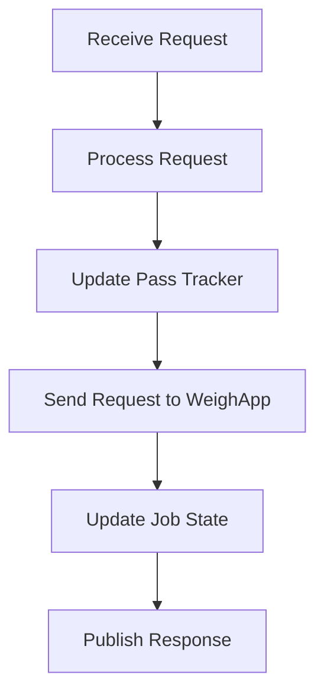

# LPS Existing Flow Info v0.1

This document explains the existing flow of `LpsSaJobMgrApp` and `LpsSaWeighApp` in plain engineering terms.

---

## 1. Repository Areas In Scope

```text
CPM-Loader-ais/apps/LpsSaJobMgrApp
CPM-Loader-ais/apps/LpsSaWeighApp
CPM-Loader-ais/config/LpsSaJobMgrApp.rb
CPM-Loader-ais/config/LpsSaWeighApp.rb
CPM-Loader-ais/config/interfaces_Loaders.rb
CPM-Loader-ais/prod/common/interfaces
TES-common-ais/prod/common/interfaces
lps_weighing
lps_pass_tracker
lps_cal
lps_common
lps_app_common
```

---

## 2. What SCS Is Doing Here

SCS acts as middleware between AIS tasks. Generated interfaces expose typed input and output channels. Application code fetches or binds these interfaces and then reads or publishes typed payloads.

Conceptual mapping:

```text
SCS OutputInterface -> ROS 2 publisher
SCS InputInterface  -> ROS 2 subscription
SCS publish()       -> ROS 2 publish()
SCS get()/read      -> ROS 2 callback/latest sample
```

---

## 3. JobMgr Functional Summary

`LpsSaJobMgrApp` receives requests from UI/SCS, reads weighing results from `LpsSaWeighApp`, updates job/pass-tracking state, controls some output behavior, persists live values, and publishes UI status.

## JobMgr Request Flow



### Inputs

```text
LpsSaJobMgrReqstChannelInput
LpsSaWeighRespChannelInput
LpsSaWeighTxChannelInput
SwitchInputScsInput
AisJhm2TxChannelInput
ShmClockInput
```

### Outputs

```text
LpsSaJobMgrTxChannelOutput
LpsSaJobMgrRespChannelOutput
LpsSaJobMgrDebugChannelOutput
LpsSaWeighReqstChannelOutput
OutputChannelOutput
```

### JobMgr Request Handling

Requests processed include:

```text
Zero
MinusOne
Clear
Store
Standby activate/deactivate
Truck/pile tip-off toggle
Manual tip-off activate/deactivate
Reweigh
Target weight
Tip-off trigger
Tip-off state
Lifetime totals
Horn-store state
```

### Pass Tracker Integration

JobMgr wraps `lps_pass_tracker`.

Important API:

```cpp
LpsPtInit(...)
LpsPtUpdate(...)
weigh_mode(...)
```

Important input struct:

```text
LpsPtInputs_t
```

Important output struct:

```text
LpsPtOutputs_t
```

---

## 4. WeighApp Functional Summary

`LpsSaWeighApp` is the core payload weighing application. It converts sensor and machine data into weighing library inputs, runs the weighing algorithm, manages calibration, handles zeroing/reset requests, publishes payload status, and manages calibration NVM.

### Inputs

```text
LpsSaWeighReqstChannelInput
PwmInputChannelsInput
LpsSaJobMgrTxChannelInput
MachineInput
LpsCalCmdReqstChannelInput
DataLinkDataInput
AisJhm2TxChannelInput
SEAStatusInput
```

### Outputs

```text
LpsSaWeighRespChannelOutput
LpsSaWeighTxChannelOutput
LpsSaWeighDebugChannelOutput
LpsSaWeighInitDebugChannelOutput
LpsSaNvmCalDataChannelOutput
LpsSaNvmCalOnTheFlyDataChannelOutput
LpsSaJobMgrReqstChannelOutput
LpsCalCmdRespChannelOutput
```

### Weigh Requests

Handled request types include:

```text
Zero adjust
Best bucket reset
Capture cylinder extension reference
Clear reweigh warning
Weigh range
Calibration weight
Last payload weight set
Loader bucket payload target weight
Payload overload warning enable
```

---

## 5. Weighing Library Integration

Important public API from `lps_weighing`:

```cpp
LpsInit(...)
LpsUpdt(...)
LpsChkInputStat(...)
LpsGetRawInstWt(...)
LpsGetLiftCylPres(...)
LpsGetWeighRangeWeight(...)
LpsWeighGetBestAvailableBktWt(...)
LpsWeighResetBestAvailableBktWt(...)
LpsWeighGetDigState(...)
GetDumpStateStatus(...)
LpsWeighGetStallStat(...)
LpsWeighGetBucketLoadFactor(...)
```

The main runtime input is:

```text
LpsUpdtTbl_t
```

`LpsUpdtTbl_t` contains hydraulic pressure, cylinder extension, cylinder velocity, oil temperature, pass count, zero button state, tilt values, bucket angle, requested gear, payload target, standby state, and related flags.

---

## 6. Calibration Library Integration

Important API from `lps_cal`:

```cpp
LpsCalInit(...)
LpsCalUpdate(...)
LpsCalGetCalStatus(...)
LpsCalGetLastPayloadWeight(...)
LpsCalGetQualReadStatus(...)
```

Calibration is currently part of WeighApp behavior and should initially remain inside the ROS 2 Weigh node instead of becoming a separate node.

---

## 7. External Interface Meaning

### `PwmInputChannels`

```text
ActualTimeUs
ExecTime
DiffTime
Exp
Width[4]
Period[4]
```

Used by WeighApp to compute lift/tilt sensor values.

### `Machine`

Provides machine state such as hydraulic, payload, linkage, drivetrain, time, fuel, GPS, key switch, and related signals.

### `DataLinkData`

Acts as a parameter/PID database with metadata, scaling, offsets, units, diagnostic counters, GPS/timezone helpers, and variable-length parameter support.

### `OutputChannel`

Used to command output ports such as horn output.

### `SwitchInputScs`

Provides four switch-to-ground input states:

```text
OPEN
CLOSED
UNKNOWN
```

### `ShmClock`

Provides system/UTC/shared-memory clock and time metadata.

### `SEAStatus`

Provides SEA status entries with fields like free count, reason code, and status.

---

## 8. Existing Timing

```text
JobMgr cycleRate_hz: 10.0
WeighApp cycleRate_hz: 10.0
Weighing library ExecRate: 0.02 seconds
```

The ROS 2 port should preserve the observable 10 Hz app behavior while respecting the 20 ms library execution configuration when wrapping the weighing algorithm.

---

## 9. Porting Principle

The algorithms already exist and expose C-style APIs. Therefore:

```text
Do not rewrite payload calculation.
Do not rewrite pass tracking.
Do not rewrite calibration first.
```

Instead:

```text
Bridge communication.
Wrap existing libraries.
Validate parity.
Then replace SCS dependencies gradually.
```
